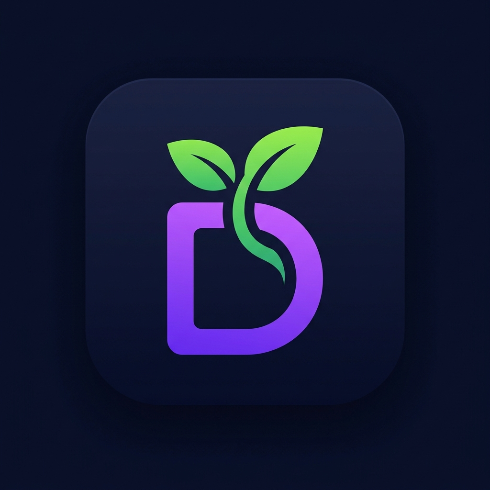

  

<h1 align="center">Duogrow</h1>

  <strong>一个面向中年人、老年人和带娃家长的极简、游戏化开口英语口语学习小工具。</strong>

  
  
  
  

本项目定位为极简、低成本的口语学习与日常表达练习工具，旨在帮助普通家庭（如父母、孩子）轻松练习日常生活场景中的高频短句，让 AI 成为温暖、可复听、可打卡陪伴的口语助教。

> 💡 **灵感来源**
> 本项目最初开发于 `2026.5.10`，作为送给母亲的母亲节礼物。后来对整体 UI 做了游戏化视觉重设计（深色霓虹风格）并使用 Capacitor 封装为原生 Android 安装包，支持单词级评分和本地离线音频缓存。
> *（不得不说，感觉大晚上我还在写这么好看的 README 简直是在感动自己，明早导师催的 NLP 任务快来不及写了呜呜呜 😭）*

GitHub 仓库：[https://github.com/connectedGraph/DuoGrow-SPA](https://github.com/connectedGraph/DuoGrow-SPA)

---

## 项目形态

* **单 HTML 文件版本**：`classic` 分支的 `v1+.html` 可以直接打开，也适合静态部署。
* **ESM拆分代码版本（游戏化）**：当前 `main` 分支，使用 `build.js` 构建为单文件 `dist.html`，用于后续工程化维护、主题切换和多版本同步。
* **静态 LLM 调用**：前端直接调用 OpenAI-compatible API，不需要自建后端。
* **BYOK**：用户自带文本模型 API Key 和语音 API Secret。
* **本地存储**：学习数据默认保存在浏览器 `localStorage`。

---

## 功能

* **场景化生成**：输入生活场景，生成 5 句或 10 句亲子英语表达。每句包含英文、中文解释和适合使用的场景。
* **随身听仓库**：保存整组内容到仓库，支持单句播放、整组播放、全仓库循环听和后台听。
* **轻量复习**：复习页会从保存过的表达里抽题，记录答对、答错和熟练度。
* **每日一记卡片**：随机抽取内容生成适合手机保存的图片，支持长按存入相册。

* **智能缓存**：音频会缓存到本地，重复播放时优先读取缓存，减少重复请求。

### 游戏化激励（v2 新增）

* **XP 与等级**：完成生成、保存、复习等学习动作获得经验值，积累升级，从"新手妈妈"逐步晋升到更高等级。
* **连续打卡**：记录每日学习连续天数，保持学习节奏，断签会重置。
* **PK 竞技场**：模拟匹配对战，支持中译英、英译中等多种答题模式，带段位晋升动画。
* **徽章系统**：分级可升级徽章，完成特定成就解锁，支持徽章详情查看和升级动画。
* **每日推送**：机器人气泡消息，每天推送学习提醒和趣味内容，基于种子随机保证每日不同。
* **个人档案**：汇总学习数据、等级、徽章和打卡记录的个人主页。
* **暗色/亮色主题**：一键切换深色和浅色主题，暗色主题带霓虹风格。
* **沉浸模式**：专注学习时隐藏导航干扰，减少视觉噪音。

---

## 接口与密码配置

### 文本生成与大模型配置

*   **默认配置**：默认使用 DeepSeek API（`apiBase`: `https://api.deepseek.com`，`model`: `deepseek-v4-flash`），方便非技术用户（如父母）一键直接使用。
*   **高级配置**：在此版本中，点击右上角的 **⚙️ 高级配置** 可打开弹窗，自定义配置您的 **API Key**、**Base URL**（支持各类 OpenAI-compatible 兼容接口）以及 **模型名称 (Model)**。

### 语音 (TTS) 与评测 API

语音发音默认支持多重自动降级机制，保证在不同环境下的优质体验：
1.  **第一重：自建 Mimo TTS 中转**（首选免费通道，音色优美）。
2.  **第二重：有道智云 (YOUDAO) TTS API**（需配置密钥，作为备用）。
3.  **第三重：免费 Kokoro TTS 接口**（最终兜底通道）。

口语跟读评测直接调用专有 API 进行发音分值和单词级发音高亮分析。

### 密码/密钥输入格式

右上角密码框输入支持以下格式，系统会自动兼容并智能解析：

1.  **直接输入 DeepSeek/OpenAI 密钥 (推荐，给妈妈最快直接使用)**
    直接填入 API Key 即可，例如：`sk-xxxxxxxxxxxx`。
    在此模式下，大模型对话可直接调通，语音部分将自动通过 Mimo/Kokoro 免费通道加载，无需配置有道密钥。
2.  **输入组合密码（混合兼容格式）**
    格式为：`sk-xxxx-yyyy`（由减号连接）。
    *   前半部分 `sk-xxxx` 会被解析为文本生成 API Key。
    *   最后一段 `yyyy` 会被解析为有道语音 API Secret。
3.  **使用高级配置面板直接输入**
    打开“⚙️ 高级配置”面板，分别在输入框中填入并保存。

---

## 当前局限与优化空间 (UI/UX)

目前的 UI/UX **依然过分注重功能而非体验**。
老实说，目前的上线版本优先为了"体感良好"做了大量的兼容性优化（比如到处打补丁的音频缓存、移动端长按保存等），但在美观度和交互直觉上还有很大提升空间。

更重要的是，如何**真正提高老妈的学习积极性**、打破目前相对单一的学习模式，是后续迭代的核心痛点。

---

## 部署与合规思路

当前版本是前端应用，`main` 分支使用 `build.js` 构建为单文件 `dist.html`，可直接打开或上传到任意静态网页托管服务。`classic` 分支的 `v1+.html` 同样可以直接使用。

**关于静态 HTML 的优势，懂的都懂 —— 正是在于"简审查"**。
如果你需要探索国内静态分发，可以参考 `web2html.com` 这类静态部署/网页封装方式，作为一种免人工审核的静态部署思路。

> 📬 **欢迎提案**：如果你有更好的部署方案（例如基于 React 的快捷部署、国内访问良好、且能做到**零审查/机器快审**的平台），强烈欢迎在 Issues 中提供建议！

---

## 本地数据

应用使用 `localStorage` 保存当前课程、仓库主题、复习表达、每日一记抽取结果、生成缓存、游戏化数据（XP、等级、徽章、打卡）和组合密码。更换浏览器或清理缓存后数据会丢失，本版本默认不上传任何数据。

---

## 分支说明

| 分支 | 说明 |
|------|------|
| `main` | 游戏化版本（ESM 拆分），带 XP、等级、竞技场、徽章等激励系统 |
| `classic` | 经典版本，单文件 `v1+.html`，功能完整但无游戏化元素 |

---

## 开源协议

本项目定位为 **MIT License** 开源项目。你可以基于它学习、修改、部署和二次开发。

---

## Roadmap

* **激发兴趣（核心）**：探索更多能调动父母学习积极性的趣味模式。
* **多主题支持**：同步提供古诗词、中老年英语、亲子阅读和生活照护表达等主题。
* **架构重构**：使用 DDD 思路拆分领域配置，让主题、提示词、词库和 UI 文案可以一键切换。
* **小程序生态**：未来可能提供一套 `html2miniprogram` 的小程序模板，支持一键将 HTML 应用转换为微信小程序。
* **小白部署指南**：增强静态部署说明，让非技术用户也能把自己的学习工具部署给家人使用。
